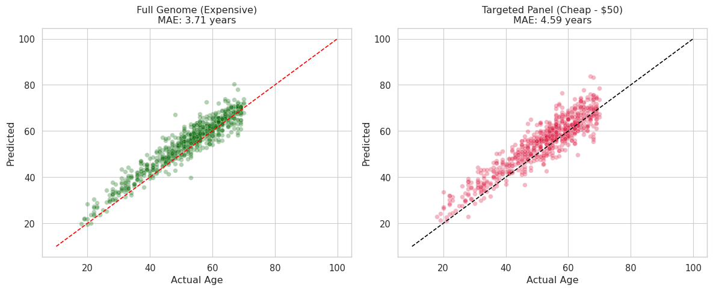

Open Epigenetic Clock: Robust Biological Age Estimation 🧬

A production-ready machine learning framework for estimating biological age from DNA methylation data. Includes a validated 20-CpG "Lite" Clock optimized for low-cost screening.

📌 Project Overview

Epigenetic clocks (Horvath, Hannum, etc.) are the standard tools for quantifying biological aging. Most require expensive genome-wide methylation arrays (~$300+ per sample), limiting accessibility.

This project provides an open, reproducible pipeline to:

Train an Elastic Net–based age estimator using public methylation data (n=656).

Blindly validate on an external cohort (n=689).

Build a commercially viable 20-CpG panel that retains ~85% of baseline accuracy at ~10% of the sequencing cost.

📊 Key Performance Metrics

Training: Hannum cohort (GSE40279)
Validation: Liu cohort (GSE42861)

Model Comparison Table (Correct Markdown)
| Model Version | Feature Count | MAE (Validation) | Correlation (R) | Est. Cost per Test |
| :--- | :--- | :--- | :--- | :--- |
| **Full Genome** (Baseline) | ~5,000 CpGs | **3.71 Years** | > 0.95 | ~$300 (Array) |
| **Startup "Lite" Panel** | 20 CpGs | **4.59 Years** | > 0.90 | ~$50 (Targeted) |

📈 Validation Results

🧬 Biological Discovery

The model independently rediscovered well-established aging biomarkers:

ELOVL2 (cg16867657) — canonical forensic age marker; strongest signal.

FHL2 (cg22454769) — linked to cardiovascular aging.

KLF14 (cg14361627) — associated with metabolic traits and T2D risk.

ITGA2B (cg08097417) — immune and platelet aging.

The pipeline performs no biological pre-selection; these emerge purely from signal strength.

🛠️ Methodology & Tech Stack

Language: Python 3.10+
Libraries: pandas, scikit-learn, numpy, seaborn
Algorithm: Elastic Net Regression with cross-validation
Design: High-dimensional genomic modeling (p >> n)

Pipeline Architecture

Data Ingestion
Automated download of raw beta-value matrices (GEO).

Preprocessing

Probe alignment

Missing value imputation

Remove sex-chromosome probes

Feature Selection
Univariate ranking using f-regression.

Model Training
Elastic Net with tuned alpha + L1/L2 ratio.

Lite Panel Productization

Select top 20 biomarkers

Fit a linear model for deployment

Export final CSV weights

🚀 Installation & Usage
1. Clone the Repository
git clone https://github.com/bayexl/open-epigenetic-clock.git
cd open-epigenetic-clock

2. Install Dependencies
pip install -r requirements.txt

3. Run the Pipeline
jupyter notebook Epigenetic_Clock_Final.ipynb

📂 Repository Structure

Epigenetic_Clock_Final.ipynb — full pipeline (training → validation → plotting)

startup_clock_final.csv — the 20-CpG Lite clock (gene IDs + weights)

top_biomarkers.csv — ranked list of significant CpGs

requirements.txt — environment dependencies

Lead Investigator: Baiel Zhumadylov

Contributions are welcome. Open an issue to discuss new features (e.g., PhenoAge/GrimAge integrations).

📄 License

Distributed under the MIT License.
